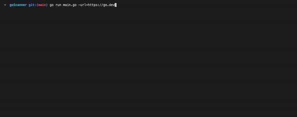

# downDetector

downDetector performs a quick probe of a site's status.

## Overview
* Success is a 200 Status Code.
* Use the url ("-u") flag to scan a single url.
* Use the input ("-i") flag to scan multiple urls concurrently. Include just one url per line in your txt file.
* downDetector makes 3 GET requests per url by default. Adjust this with the attempts flag ("-a). Be responsible.

## Additional Notes
* Possible flags: url, attempts, timeout, input.

## Support
* Like downDetector? Use it, star it, and share with your friends!
    - Let me know what you're up to so I can feature your work here.
* Want to see a particular feature? Found a bug? Question about usage or documentation?
    - Please raise an issue.
* Pull request?
    - Please discuss in an issue first. 

## License
* downDetector is released under the MIT license. See [LICENSE](LICENSE) for details.